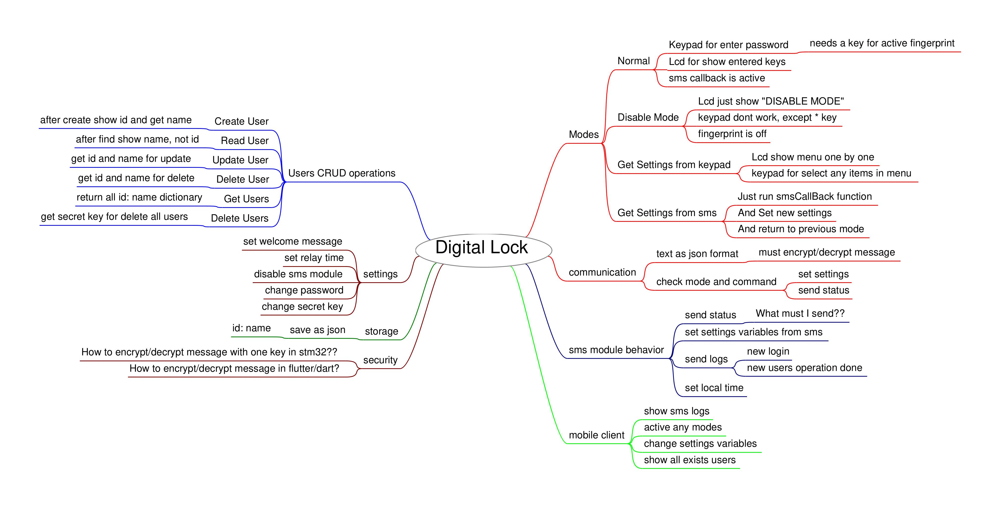
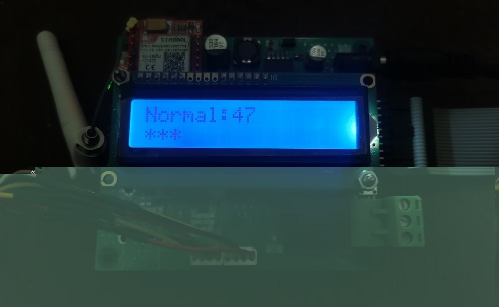
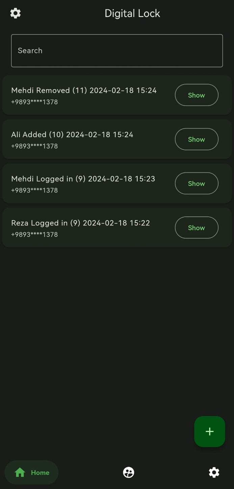

# Digital Lock

A **Digital Lock** with fingerprint and sms module and has android client to integrate and manage the hardware.

## Getting Started

* For hardware code see [stm32code](./stm32code/digital-lock/README.md)
* For Android client see [client](./client/digital_lock/README.md)

## Mind Map of this project

## Screenshot

The Main Board | The Mobile Client
--- | ---
 | 
