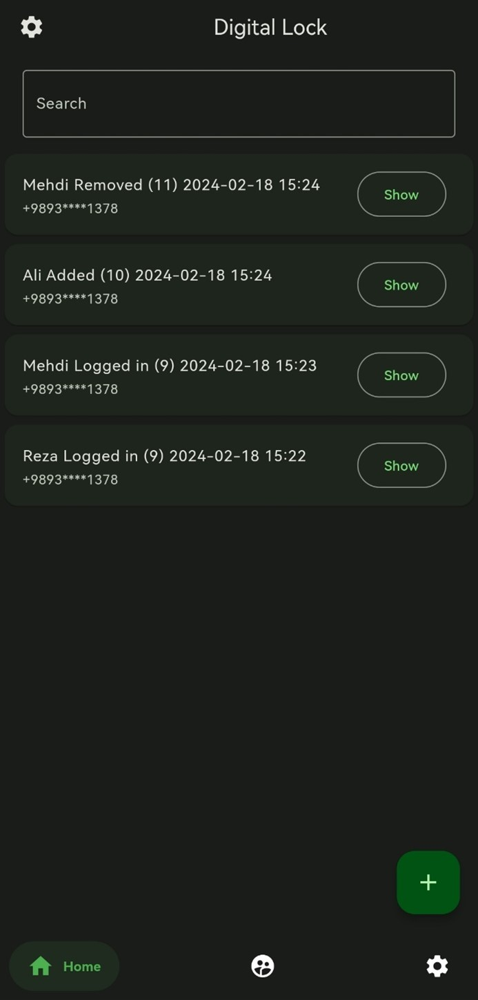

# Digital Lock Client (Android)

A client app for integrate and manage the digital lock module.

## Usage

### Getting Started

You need to install

* [Flutter](https://docs.flutter.dev/get-started/install)
* [Android Studio](https://developer.android.com/studio/install) (and sdk)
* [VS Code](https://docs.flutter.dev/get-started/editor?tab=vscode) (recommended for code editing)

For build **Android** app, you must follow [this steps for Sign the app](https://docs.flutter.dev/deployment/android#sign-the-app)
And run:

```bash
flutter build apk --verbose
```

Then you can see the output apk file in `build/app/outputs/apk/release/app-release.apk`

### Format The Code

Run this command on base directory:

```bash
dart format .
```

## Screenshots

Login Page | Main Page | User Page | Settings Page
--- | --- | --- | ---
 |  |  | 
