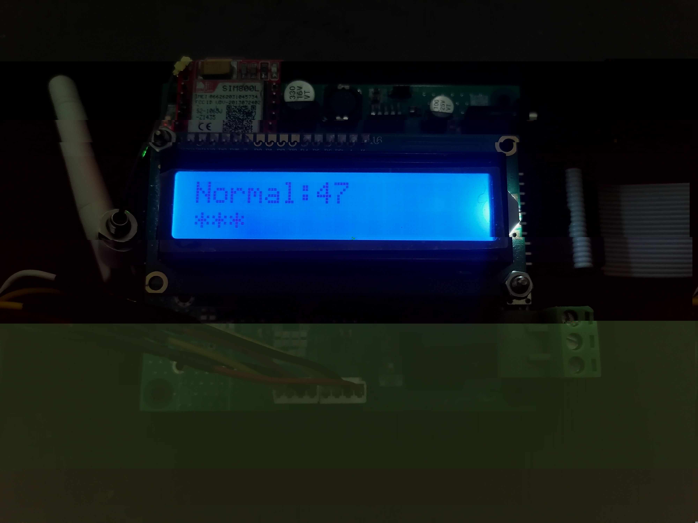

# Digital Lock Software

A software that run on digital lock hardware.

## Usage

### Getting Started

You need to install

* [Arm Gnu Toolchain](https://developer.arm.com/downloads/-/arm-gnu-toolchain-downloads)
* [OpenOCD](https://openocd.org/pages/getting-openocd.html)
* [Gnu Make](https://www.gnu.org/software/make/)

For Build the project, you must run:

```bash
make
```

For Upload code to hardware, you must to connect the programmer to laptop and run:

```bash
make flush
```

### Format The Code

You need to have `clang-format` in PATH
Then run:

```bash
make format
```

## Screenshot

Normal Mode | Disable Mode | Add User Mode
--- | --- | ---
 |  | 
